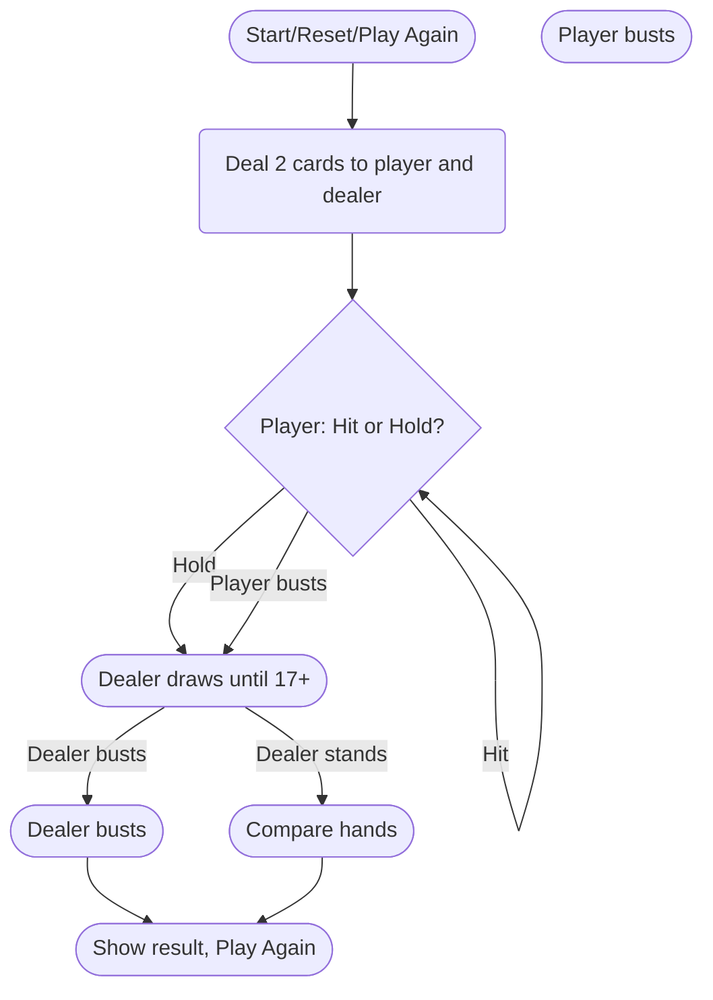

# Simple Blackjack

## Overview

This project is a TypeScript React static site implementing a simple Blackjack game with the following features:

- Four actions: **Hit**, **Hold**, **Reset**, and **Play Again** (all as visible buttons).
- Cards and points are displayed as plain text (no images or animations).
- **Play Again** button is only visible when the game is completed, not during the round.
- After each round, **Play Again** resets the game state (identical to **Reset**).
- No state is persisted between rounds.
- The **Hit** button is hidden when the player's hand totals 21 or more points.
- Ace handling: During the round, if both Ace values (1 and 11) are valid and keep the hand under 21, both are displayed. If only one value is valid (≤ 21), only that value is shown. When the player holds, the best interpretation of Aces for their hand is used for scoring.

## Game Rules and Logic

- A finite deck is used (cards are removed as dealt).
- Both player and dealer hands/points are shown.
- Only the dealer's first card is visible before the player holds or busts; the rest of the dealer's hand is hidden until the dealer's turn.
- After the player holds or busts, the dealer reveals all cards and draws until reaching at least 17 points.
- The winner is determined after the dealer's turn, regardless of whether the player has busted.

### Win/Lose/Tie Criteria

- **Player wins** if they have ≤ 21 points and the dealer has fewer points or busts.
- **Tie** if the player and dealer have the same points or both bust.
- **Player loses** in all other cases.

## Game Flow

## Implementation Steps

- Design Blackjack game state and logic (finite deck, hands, scoring, Ace handling, dealer logic)
- Implement UI: display player and dealer hands/points, and action buttons ("Hit", "Hold", "Reset", "Play Again")
- Implement Ace value display logic (show both values if valid during the round, best value on hold)
- Implement button visibility logic (hide "Hit" at 21+)
- Implement round reset and "Play Again" functionality
- Test all game flows for correctness
